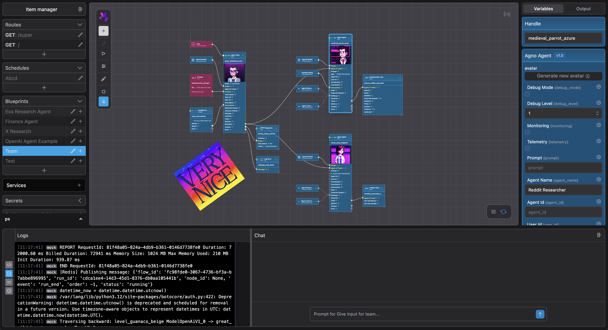

<div align="center">
  
</div>

# PolySynergy Orchestrator

---

## 🚧 Work in Progress

**This project is currently under active development and is not yet ready for local installation and setup.** Work is in progress to make AWS cloud dependencies optional to enable easier local development and testing. Please check back soon for updates.

### 🔗 Submodule Repositories

The following components are maintained as separate repositories and included as git submodules:

- **[Portal](https://github.com/dionsnoeijen/polysynergy-portal)** - Next.js visual workflow editor
- **[API Local](https://github.com/dionsnoeijen/polysynergy-api-local)** - FastAPI orchestration backend
- **[Router](https://github.com/dionsnoeijen/polysynergy-router)** - Dynamic request routing service
- **[Node Runner](https://github.com/dionsnoeijen/polysynergy-node-runner)** - Python workflow execution framework
- **[Nodes](https://github.com/dionsnoeijen/polysynergy-nodes)** - Core node library with AI agents and integrations
- **[Nodes Agno](https://github.com/dionsnoeijen/polysynergy-nodes-agno)** - Additional specialized nodes

---

## Overview

PolySynergy Orchestrator is a **microservices-based visual automation platform** that enables users to create, manage, and execute node-based workflows through an intuitive drag-and-drop interface. Build complex automation pipelines with AI agents, integrations, and custom logic - all through a visual canvas.

<div align="center">
  
</div>

## 🌟 Key Features

### Visual Workflow Editor
- **Drag & Drop Interface**: Create workflows by connecting nodes visually
- **Real-time Collaboration**: Multiple users can work on workflows simultaneously
- **Canvas-based Design**: Intuitive node positioning with zoom and pan capabilities
- **Live Execution Monitoring**: Watch your workflows execute in real-time

### AI-Powered Automation
- **Agent Orchestration**: Integrate OpenAI, Mistral, and other AI providers
- **Vector Storage**: Context management with Qdrant integration
- **Memory Management**: Persistent chat memory with DynamoDB backend
- **Dynamic Tool Integration**: Automatic tool discovery and execution

### Enterprise-Grade Infrastructure
- **Scalable Architecture**: Microservices design with Docker containerization
- **Cloud Agnostic**: Flexible deployment options across different providers
- **Security First**: OIDC authentication, role-based access, encrypted secrets
- **Cost Effective**: Optimized for performance without excessive cloud costs

### Extensive Node Library
- **Utility Nodes**: Math operations, data transformation, file handling
- **Integration Nodes**: HTTP requests, database operations, email services
- **Control Flow**: Conditional logic, loops, scheduling, and branching
- **Custom Nodes**: Extensible framework for building your own nodes

## 🏗️ Architecture

PolySynergy follows a modern microservices architecture designed for scalability and maintainability:

### Core Services

- **Portal** (Next.js): Visual workflow editor with real-time collaboration
- **API Local** (FastAPI): Main orchestration engine and workflow management
- **Router** (FastAPI): Dynamic request routing to Lambda functions
- **Node Runner**: Python framework for workflow execution
- **Database Layer**: PostgreSQL for persistence, Redis for caching

### Infrastructure

- **Container Orchestration**: Docker Compose for local development
- **Example Cloud Architecture**: Terraform configurations for AWS deployment (reference implementation)
- **Cost Optimization**: Moved away from expensive AWS services to more economical solutions
- **Flexible Deployment**: Designed to work with various hosting providers and configurations

## 📦 Project Structure

```
orchestrator/
├── portal/              # Next.js frontend application
├── api-local/           # FastAPI backend service
├── router/              # Request routing service
├── node_runner/         # Node execution framework
├── nodes/               # Core node library
├── nodes_agno/          # Additional specialized nodes
├── infrastructure/      # Example Terraform AWS infrastructure (not in use)
├── caddy/              # Reverse proxy configuration
└── docker-compose.yml   # Local development setup
```

Each submodule has its own documentation, tests, and development workflow. See individual repositories for component-specific details.

## 🚀 Quick Start (Coming Soon)

> **Note**: Local setup instructions will be available once AWS dependencies are made optional.

### Prerequisites
- Docker & Docker Compose
- Node.js 18+ & pnpm
- Python 3.12+ & Poetry
- Cloud CLI tools (optional, for cloud deployment)

### Development Setup
```bash
# Clone the repository
git clone --recurse-submodules https://github.com/dionsnoeijen/polysynergy-orchestrator.git
cd polysynergy-orchestrator

# Start all services
docker compose up -d

# Access the application
# Portal: http://localhost:4000
# API: http://localhost:8090
# Router: http://localhost:8080
```

## 🛠️ Technology Stack

### Frontend
- **Next.js 15.3.0** with React 19 and TypeScript
- **Tailwind CSS** for styling
- **Zustand** for state management
- **Konva.js** for canvas interactions
- **WebSocket** for real-time updates

### Backend
- **FastAPI** with async/await support
- **SQLAlchemy 2.0** with PostgreSQL
- **Redis** for caching and real-time features
- **Alembic** for database migrations
- **Poetry** for dependency management

### Infrastructure
- **Docker** containerization
- **AWS ECS** for container orchestration
- **Terraform** for infrastructure as code
- **PostgreSQL** for data persistence
- **Redis** for caching and sessions

### AI & Integrations
- **OpenAI & Mistral** for language models
- **Qdrant** for vector storage
- **AWS Services** (Lambda, S3, DynamoDB, Secrets Manager)
- **PubNub** for real-time messaging

## 🔧 Development Commands

### Docker Operations
```bash
docker compose up -d        # Start all services
docker compose down         # Stop all services
docker compose logs -f      # View logs
```

### API Development
```bash
cd api-local
poetry install              # Install dependencies
poetry run pytest          # Run tests
poetry run uvicorn main:app --reload  # Start dev server
```

### Portal Development
```bash
cd portal
pnpm install               # Install dependencies
pnpm dev                   # Start dev server
pnpm build                 # Build for production
```

### Node Development
```bash
cd node_runner
poetry install             # Install dependencies
poetry run pytest         # Run tests
```

## 📚 Documentation

- **API Documentation**: Available at `http://localhost:8090/docs` when running locally
- **Architecture Guide**: See [CLAUDE.md](./CLAUDE.md) for detailed technical documentation
- **Node Development**: Check individual package documentation in respective directories

## 🤝 Contributing

Contributions are welcome! Please see the contributing guidelines and code of conduct before getting started.

### Development Workflow
1. Fork the repository
2. Create a feature branch
3. Make your changes with tests
4. Submit a pull request

### Code Standards
- TypeScript for frontend development
- Python with type hints for backend
- Comprehensive test coverage
- Docker for consistent development environments

## 📄 License

This project is licensed under the Business Source License 1.1 (BSL 1.1). See the [LICENSE](./LICENSE) file for details.

- **Open Source**: Code is publicly available and can be used freely
- **Commercial Restriction**: Cannot be offered as a commercial SaaS by third parties
- **Change Date**: January 1, 2028 (becomes Apache 2.0 license)

## 🌐 Links

- **Website**: [polysynergy.com](https://polysynergy.com)
- **Community**: [Join our Discord](https://discord.gg/H8eQACAhkX)

## 🚧 Roadmap

- [ ] Make cloud dependencies optional for local development
- [ ] Enhanced node library with more integrations
- [ ] Workflow templates and marketplace

---

<div align="center">
  Made with ❤️
</div>