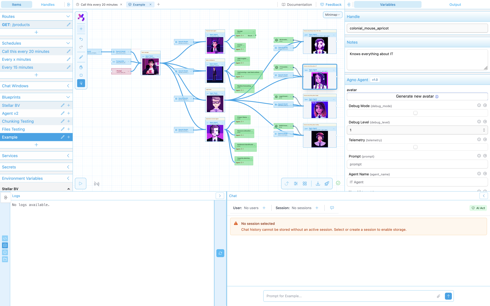

<div align="center">
  

  <h3>Open-source visual AI workflow builder for developers who need transparency and control</h3>

  <p>
    <a href="https://www.polysynergy.com">Website</a> •
    <a href="https://discord.gg/H8eQACAhkX">Discord</a> •
    <a href="https://www.polysynergy.com/ams">Documentation</a>
  </p>

  
</div>

## What is PolySynergy?

PolySynergy is a **visual workflow builder** that lets you orchestrate AI agents and integrations through a drag-and-drop interface. Unlike black-box automation tools, every step is visible, debuggable, and under your control.

**See every step. Debug like actual code. No more black box guessing games.**

Perfect for developers building AI applications who need:
- **Multi-agent orchestration** with full visibility into decision-making
- **Flexible AI provider** support (OpenAI, Anthropic, Mistral, Ollama)
- **Real-time execution** monitoring and debugging
- **Complete control** over data flow and logic

> **Status:** Currently in **alpha** - actively developed and used in production by early adopters. Expect breaking changes.

## 🚀 Quick Start

PolySynergy runs fully self-hosted with Docker - no cloud dependencies required.

```bash
# Clone with submodules
git clone --recurse-submodules https://github.com/dionsnoeijen/polysynergy.git
cd polysynergy/orchestrator

# Configure environment (copy .env.example to .env in each service)
cp api-local/.env.example api-local/.env
cp router/.env.example router/.env
cp portal/.env.example portal/.env

# Start all services
docker compose up -d

# Initialize local databases
docker compose exec api_local poetry run python scripts/init_dynamodb_local.py

# Access the platform
# Portal:  http://localhost:4000
# API:     http://localhost:8090/docs
# Router:  http://localhost:8080
```

**Requirements:** Docker, Docker Compose

**Self-hosted stack includes:**
- PostgreSQL database
- Redis for caching and pub/sub
- DynamoDB Local for execution state
- MinIO for S3-compatible object storage

### Optional: Self-Hosted AI with Ollama

For completely local AI without external APIs, add Ollama:

```bash
# Start with Ollama included
docker-compose -f docker-compose.yml -f docker-compose.ollama.yml up -d

# Pull AI models (examples)
docker exec ollama-local ollama pull llama3.1    # ~4.7 GB
docker exec ollama-local ollama pull mistral     # ~4.1 GB

# Configure in .env
echo "OLLAMA_HOST=http://ollama:11434" >> api-local/.env

# Use ModelOllama nodes in workflows
```

**Note:** Ollama requires ~10-15 GB disk space (5 GB image + models)

## Key Features

### 🎨 Visual Workflow Editor
Drag-and-drop interface with **40+ node types** including:
- AI agents (OpenAI, Anthropic, Mistral, Ollama)
- Data processing (JSON, lists, strings, files)
- Integrations (HTTP, email, AWS, databases)
- Control flow (conditionals, loops, routing)
- Custom nodes (extensible Python framework)

### 🔍 Transparency & Debugging
- Real-time execution monitoring via WebSocket
- Step-by-step workflow visualization
- Detailed logging and error tracking
- Full control over AI context and prompts

### 🚀 Deployment Options
- **Self-hosted** with Docker Compose (fully local, no cloud dependencies)
- **Cloud** deployment with AWS Lambda (optional, for serverless scaling)
- **Scalable** PostgreSQL + Redis + DynamoDB stack
- **Secure** with OIDC authentication

### 🔧 Developer-First
- Python-based node development
- REST API for programmatic access
- WebSocket for real-time updates
- Comprehensive test coverage

## Technology Stack

| Layer | Technologies |
|-------|-------------|
| **Frontend** | Next.js 15, React 19, TypeScript, Tailwind CSS |
| **Backend** | FastAPI, PostgreSQL, Redis, DynamoDB |
| **Execution** | Python 3.12, Docker / AWS Lambda |
| **AI/ML** | OpenAI, Anthropic, Mistral, Ollama |

## Project Structure

```
orchestrator/
├── portal/         # Next.js visual workflow editor
├── api-local/      # FastAPI orchestration backend
├── router/         # Dynamic request routing service
├── node_runner/    # Python workflow execution framework
├── nodes/          # Core node library (40+ types)
└── nodes_agno/     # Advanced AI agent nodes
```

Each component is a separate repository included as a git submodule. See individual repos for detailed documentation.

## Documentation

- **Architecture:** See [CLAUDE.md](./CLAUDE.md) for technical details
- **API Reference:** http://localhost:8090/docs (when running)
- **Node Development:** Check [nodes/CLAUDE.md](./nodes/CLAUDE.md)
- **Website:** https://www.polysynergy.com/ams

## Contributing

Contributions welcome! This is an early-stage project with rapid iteration.

1. Fork the repository
2. Create a feature branch
3. Submit a pull request

See individual component READMEs for development guidelines.

## License

Licensed under **Business Source License 1.1 (BSL 1.1)**

- ✅ **Free to use** for non-commercial purposes
- ✅ **Source available** - full transparency
- ❌ **Cannot offer as SaaS** to third parties
- 📅 **Becomes Apache 2.0** on January 1, 2028

For commercial licensing: [dion@polysynergy.com](mailto:dion@polysynergy.com)

## Community

- **Discord:** [Join our community](https://discord.gg/H8eQACAhkX)
- **Website:** [polysynergy.com](https://www.polysynergy.com)
- **Issues:** [GitHub Issues](https://github.com/dionsnoeijen/polysynergy/issues)

---

<div align="center">
  Built by developers, for developers who refuse black boxes.
</div>
